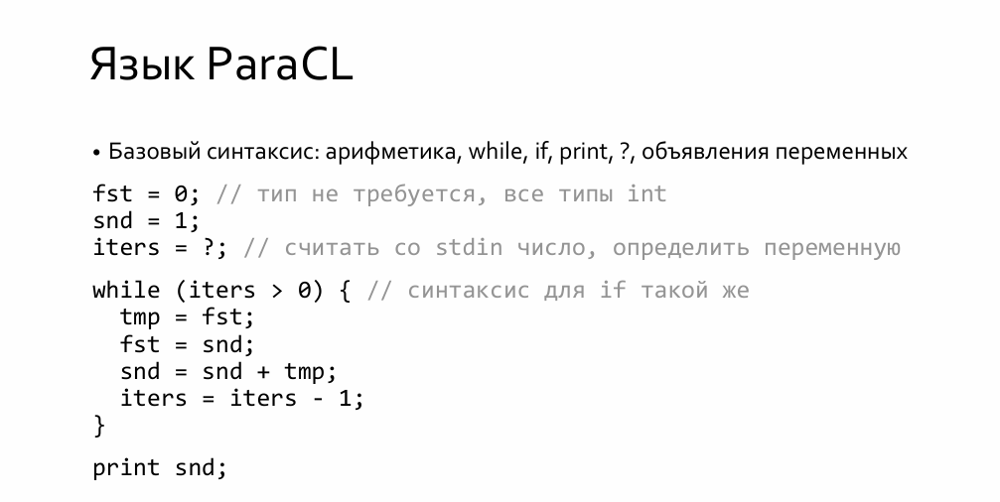

# ParaCL

A simple imperative programming language with an interpreter implemented in C++. ParaCL uses Flex for lexical analysis and Bison for parsing, with a focus on clean architecture and modern C++ practices.

## Features

- Lexical analysis via Flex
- Syntax parsing via Bison
- Abstract Syntax Tree (AST) with RAII memory management
- Interpreter with variable scoping and arithmetic evaluation
- Unit testing with GoogleTest
- CMake-based build system

## Syntax

 The syntax and grammar are based on the course assignment specification.



## Building the Project

### Prerequisites
- C++17 compatible compiler (GCC 9+, Clang 10+, or MSVC 2019+)
- CMake 3.13 or higher
- Flex and Bison
- GoogleTest (for building tests)

### WSL / Windows Subsystem for Linux
```bash
git clone https://github.com/Dariazeml1007/ParaCL.git
cd ParaCL

mkdir build
cmake -B build
cmake --build build
```
### Linux
```bash
git clone https://github.com/Dariazeml1007/ParaCL.git
cd ParaCL

mkdir -p build
cmake -S . -B build -DCMAKE_BUILD_TYPE=Debug
cmake --build build
```
## Running the Interpreter
```bash
./build/bin/ParaCL program.pcl
```

## Testing
The project includes unit tests for both the parser and the interpreter.

### Run all tests
```bash
cd build
ctest -V
```
### Parser tests only
```bash
./build/paracl_parser_tests
```
### Interpreter tests only
```bash
./build/paracl_interpreter_tests
```
### Filter by test name pattern
```bash
./build/paracl_interpreter_tests --gtest_filter="*Arithmetic*"
```
